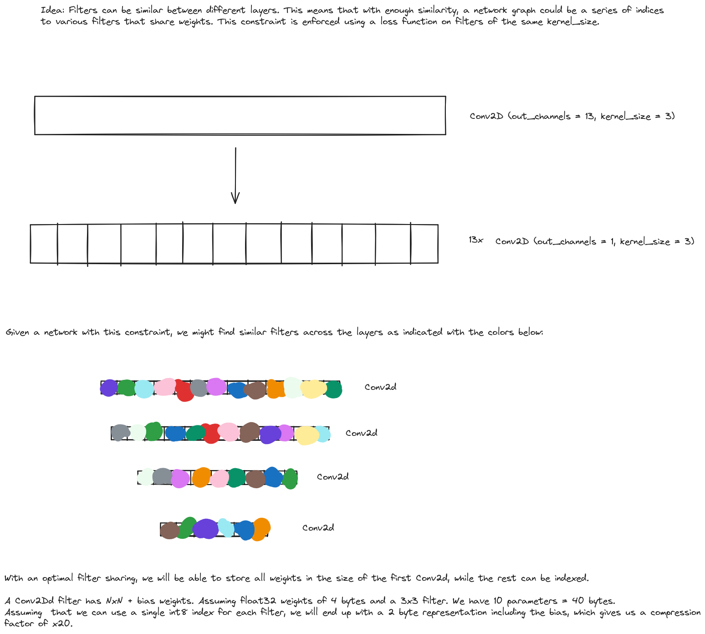

The idea is to use loss functions to try to make filters as similar as possible between layers.

This can in turn let us more efficient network representations - we could index existing weights and thus save memory in network binary.

The first step encapsulates doing this for squeezenet in order to verify feasibility, if it works, we can construct architectures that allow this in a better way.

